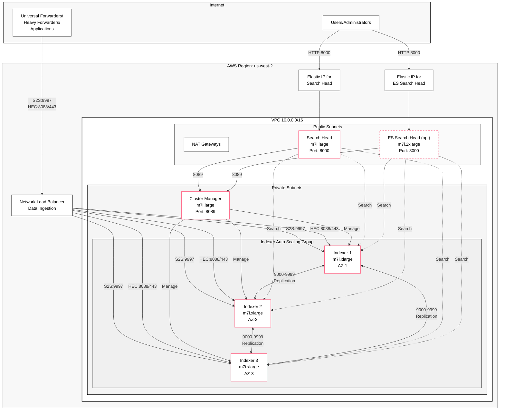
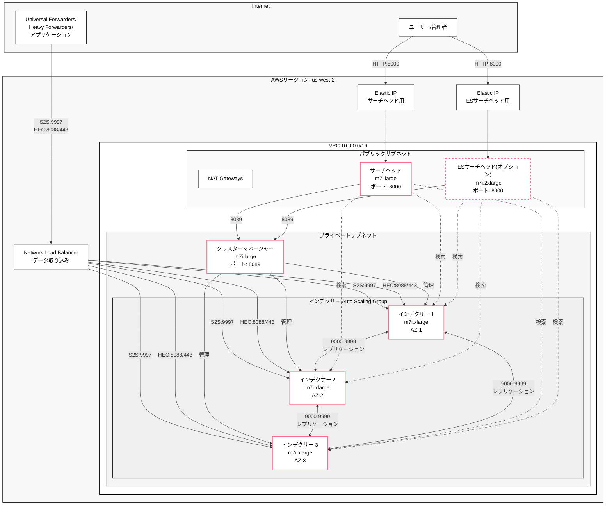

# Self-Managed Splunk Enterprise on AWS

[English](#english) | [日本語](#japanese)

<a name="english"></a>
## English

This project deploys a Splunk Enterprise cluster on AWS using AWS CDK, following Splunk Validated Architecture (SVA) best practices.

### 🎯 Project Purpose

**This project is designed as a production-like validation environment for Splunk Enterprise on AWS.** It provides a fully automated deployment of a multi-AZ Splunk cluster that mirrors production configurations, enabling teams to:

- Validate Splunk configurations before production deployment
- Test data ingestion patterns and search performance
- Evaluate Enterprise Security (ES) implementations
- Conduct performance testing and capacity planning
- Train operations teams on Splunk cluster management
- Demonstrate Splunk capabilities to stakeholders

> **💡 Note**: This deployment is optimized as a validation environment with cost-saving measures like a single NAT Gateway. It's designed for testing, training, and evaluation purposes.

### Architecture Overview



#### Component Details:
- **Users/Administrators**: Access Splunk Web UI through Elastic IPs for search and administration
- **Universal/Heavy Forwarders**: Send log data to Splunk cluster via NLB
  - **Universal Forwarders**: Lightweight agents for log collection
  - **Heavy Forwarders**: Can parse and route data before forwarding
  - **Applications**: Direct HTTP event submission via HEC
- **Cluster Manager**: Manages indexer cluster, handles data distribution policies
- **Indexers**: Store and index data, distributed across 3 AZs for high availability
- **Search Head**: User interface for searching data across indexers (configured with indexer cluster awareness)
- **ES Search Head**: Dedicated instance for Enterprise Security app (optional, configured with indexer cluster awareness)
- **Network Load Balancer**: Handles data ingestion (S2S and HEC) with automatic load distribution
- **Replication Factor**: 3 (each data block stored on 3 indexers)
- **Search Factor**: 2 (searchable copies on 2 indexers)

#### Data Ingestion:
- **S2S (Splunk-to-Splunk)**: Port 9997 via NLB for forwarder data
- **HEC (HTTP Event Collector)**: 
  - HTTP: Port 8088 via NLB
  - HTTPS: Port 443 via NLB with SSL/TLS termination (optional, requires certificate)
- **Load Distribution**: NLB automatically distributes incoming data across all healthy indexers

The deployment creates:
- **Network Infrastructure**: VPC with 3 Availability Zones
- **Splunk Cluster**: 
  - 1 Cluster Manager (m7i.large)
  - 3 Indexers (m7i.xlarge) distributed across AZs
  - 1 Search Head (m7i.large)
  - 1 Enterprise Security Search Head (m7i.2xlarge) - optional
- **Direct Access**: Elastic IPs for direct web access
- **Security**: Secrets Manager for password management, security groups for access control
- **OS**: Amazon Linux 2023 (officially supported by Splunk Enterprise)

### Stack Names
- `SelfManagedSplunk-Network` - Network infrastructure
- `SelfManagedSplunk-IndexerCluster` - Indexer cluster with Cluster Manager
- `SelfManagedSplunk-SearchHead` - Search Head with Elastic IP
- `SelfManagedSplunk-DataIngestion` - Network Load Balancer for S2S and HEC
- `SelfManagedSplunk-ES` - Enterprise Security (optional)

### Enterprise Security (ES) Support

This deployment supports Splunk Enterprise Security as an optional component:
- Dedicated ES Search Head with enhanced resources (m7i.2xlarge)
- Pre-configured ES indexes (risk, notable, threat_intel, etc.)
- Data model acceleration setup
- Dedicated Elastic IP for direct access

**Important**: The ES package must be downloaded separately from Splunkbase and placed in the `packages/` directory before deployment.

### Prerequisites

- AWS CLI configured with appropriate credentials
- Node.js 20.x or 22.x installed
- AWS CDK CLI installed (`npm install -g aws-cdk`)
- Splunk Enterprise license (60-day trial available)
- For ES deployment: Download ES package from [Splunkbase](https://splunkbase.splunk.com/app/263)
- (Optional) For interactive deployment: `npm install --save-dev inquirer@^8.0.0`

### Deployment Instructions

#### 🚀 Quick Deploy Options

**Option 1: Interactive Deployment (Easiest)**
```bash
# Install inquirer (first time only)
npm install --save-dev inquirer@^8.0.0

# Run interactive deployment
npm run deploy:interactive
```

The interactive deployment wizard includes:
- **AWS Profile Selection**: Choose from available AWS profiles or use environment variables
- **Auto-approve Option**: Option to use `--require-approval never` for unattended deployments
- **Automatic Detection**: ES packages and license files are automatically detected
- **Configuration Review**: Review all settings before deployment

**Option 2: Pre-configured Deployments**
```bash
# Basic deployment (no ES, no license)
npm run deploy:basic

# Deploy with ES and license
npm run deploy:es

# Large deployment with ES and license
npm run deploy:production
```

**Option 3: Custom Deployment with Context Parameters**
```bash
# Enable specific features with medium deployment
npx cdk deploy --all \
  --context deploymentSize=medium \
  --context enableES=true \
  --context enableLicense=true
```

**Option 4: Using the deployment script**
```bash
./deploy.sh
```

This script will:
- Configure AWS authentication (supports AWS SSO)
- Set up Oregon region (us-west-2) by default
- Install dependencies
- Build the project
- Bootstrap CDK if needed
- Check for ES package if ES deployment is requested
- Deploy all stacks

#### Manual Deployment

1. **Clone the repository**
   ```bash
   git clone <repository-url>
   cd self-managed-splunk-aws
   ```

2. **Install dependencies**
   ```bash
   npm install
   ```

3. **Configure AWS Authentication**
   
   **Option A: Using AWS SSO (Recommended)**
   ```bash
   # Check current AWS configuration
   aws configure list
   
   # If not authenticated, login via SSO
   aws sso login --profile <your-profile-name>
   
   # Set the profile
   export AWS_PROFILE=<your-profile-name>
   
   # Verify authentication
   aws sts get-caller-identity
   ```
   
   **Option B: Using IAM credentials**
   ```bash
   # Configure AWS credentials
   aws configure
   # Enter your Access Key ID, Secret Access Key, and preferred region
   ```

4. **Configure AWS environment**
   ```bash
   export AWS_REGION=us-west-2  # Oregon region (recommended)
   export CDK_DEFAULT_ACCOUNT=$(aws sts get-caller-identity --query Account --output text)
   export CDK_DEFAULT_REGION=$AWS_REGION
   ```

5. **Bootstrap CDK (first time only)**
   ```bash
   npx cdk bootstrap
   # Or with specific profile
   npx cdk bootstrap --profile <your-profile-name>
   ```

6. **Deploy the stacks**
   
   **Option A: Basic deployment (without Enterprise Security)**
   ```bash
   npx cdk deploy --all
   # Or with specific profile
   npx cdk deploy --all --profile <your-profile-name>
   ```

   **Option B: Deployment with Enterprise Security**
   
   First, download the ES package:
   ```bash
   # Create packages directory
   mkdir -p packages
   # Download ES from Splunkbase and place in packages/
   # Example: packages/splunk-enterprise-security_8.1.1.spl
   ```
   
   Then deploy using one of these methods:
   ```bash
   # Method 1: NPM script (recommended)
   npm run deploy:es
   
   # Method 2: Context parameter
   npx cdk deploy --all --context enableES=true
   
   # Method 3: Environment variable
   export ENABLE_ES=true
   npx cdk deploy --all
   ```
   
   **Option C: Deployment with License**
   
   If you have a Splunk Enterprise license:
   ```bash
   # Create licenses directory
   mkdir -p licenses
   
   # Place your license file in the directory
   # Supported formats: .lic, .License
   # Example: licenses/Splunk.License
   
   # Deploy using one of these methods:
   
   # Method 1: Context parameter (no config file changes needed)
   npx cdk deploy --all --context enableLicense=true
   
   # Method 2: NPM script with ES and license
   npm run deploy:es
   
   # Method 3: Environment variable
   export ENABLE_LICENSE=true
   npx cdk deploy --all
   ```

   **Option D: Deployment with HTTPS for HEC**
   
   Enable HTTPS/TLS for HTTP Event Collector:
   ```bash
   # Method 1: Using existing ACM certificate (recommended)
   npx cdk deploy --all --context domainName=arn:aws:acm:us-west-2:123456789012:certificate/abc-123-def
   
   # Method 2: Create new certificate with DNS validation
   npx cdk deploy --all --context domainName=hec.example.com --context hostedZoneId=Z1234567890ABC
   
   # Method 3: Using environment variables
   export HEC_DOMAIN_NAME=hec.example.com
   export HEC_HOSTED_ZONE_ID=Z1234567890ABC
   npx cdk deploy --all
   ```

### Deployment Time Estimation

**Total deployment time: Approximately 20-30 minutes**

Breakdown by stack:
- Network Stack: ~2-3 minutes (VPC, subnets, NAT Gateway)
- Indexer Cluster Stack: ~10-15 minutes (3 EC2 instances + Splunk installation)
- Search Head Stack: ~5-7 minutes (1 EC2 instance + Elastic IP)
- ES Stack (optional): ~5-7 minutes (1 EC2 instance + Elastic IP + ES package upload)

Note: First-time deployments may take longer due to:
- CDK bootstrap process (one-time setup)
- Splunk package downloads (~500MB per instance)
- ES package upload if enabled

### Accessing Splunk

After deployment:

1. **Get Search Head URL**
   ```bash
   aws cloudformation describe-stacks --stack-name SelfManagedSplunk-SearchHead \
     --query 'Stacks[0].Outputs[?OutputKey==`SplunkWebUrl`].OutputValue' --output text
   ```
   
   **For ES Search Head (if deployed)**
   ```bash
   aws cloudformation describe-stacks --stack-name SelfManagedSplunk-ES \
     --query 'Stacks[0].Outputs[?OutputKey==`EsWebUrl`].OutputValue' --output text
   ```

2. **Get admin password**
   ```bash
   aws secretsmanager get-secret-value \
     --secret-id $(aws cloudformation describe-stacks --stack-name SelfManagedSplunk-IndexerCluster \
     --query 'Stacks[0].Outputs[?OutputKey==`SplunkAdminSecretArn`].OutputValue' --output text) \
     --query 'SecretString' --output text | jq -r '.password'
   ```

3. **Login**
   - Search Head URL: `http://<Elastic-IP>:8000`
   - ES Search Head URL: `http://<ES-Elastic-IP>:8000` (if deployed)
   - Username: `admin`
   - Password: (from step 2)

### Accessing Instances via Session Manager

Connect to any instance without SSH keys using AWS Systems Manager Session Manager:

```bash
# List all instances
aws ec2 describe-instances --filters "Name=tag:Name,Values=*SelfManagedSplunk*" \
  "Name=instance-state-name,Values=running" \
  --query "Reservations[*].Instances[*].{Name:Tags[?Key=='Name']|[0].Value,InstanceId:InstanceId}" \
  --output table

# Connect to an instance
aws ssm start-session --target <instance-id>

# Example: Connect to Cluster Manager
aws ssm start-session --target i-0123456789abcdef
```

Or use the AWS Console:
1. Go to EC2 Console → Instances
2. Select the instance
3. Click "Connect" → "Session Manager"

### Accessing Enterprise Security (if deployed)

1. **ES Web UI URL**
   ```bash
   aws cloudformation describe-stacks --stack-name SelfManagedSplunk-ES \
     --query 'Stacks[0].Outputs[?OutputKey==`EsWebUrl`].OutputValue' --output text
   ```

2. **Access Enterprise Security**
   - The ES URL is displayed in CloudFormation outputs
   - Use the same admin credentials as the main Search Head

3. **Enterprise Security Installation**
   
   **Note**: ES is not automatically installed due to licensing restrictions. Follow these steps:
   
   a. **Download ES from Splunkbase**
      - Visit https://splunkbase.splunk.com/app/263
      - Login with your Splunk account
      - Download the appropriate version (latest recommended)
   
   b. **Install via Splunk Web UI**
      ```
      1. Access the ES Search Head: http://<ES-INSTANCE-IP>:8000
      2. Login as admin
      3. Navigate to: Manage Apps → Install app from file
      4. Upload the downloaded ES .tgz file
      5. Restart Splunk when prompted
      ```
   
   c. **Initial ES Configuration**
      - Follow the ES setup wizard
      - Configure data models acceleration
      - Set up asset and identity lookups
      - Configure correlation searches based on your needs

4. **Why Manual Installation?**
   - ES requires a valid license agreement
   - Package redistribution is not permitted
   - Each environment needs proper licensing
   - Manual installation ensures compliance

### Deployment Options Configuration

#### Available Context Parameters

You can customize deployment using context parameters with `--context` flag:

| Parameter | Type | Default | Description |
|-----------|------|---------|-------------|
| `enableES` | boolean | false | Deploy Enterprise Security Search Head |
| `enableLicense` | boolean | false | Install enterprise license from licenses/ |
| `deploymentSize` | string | medium | Deployment size: medium, large |
| `skipConfirmation` | boolean | false | Skip deployment confirmation prompt |

#### Pre-configured Deployment Sizes

| Size | Indexers | RF | SF | Indexer Type | Search Head | ES Search Head | Use Case |
|------|----------|----|----|--------------|-------------|----------------|----------|
| **medium** | 3 | 3 | 2 | m7i.xlarge | m7i.large | m7i.2xlarge | Validation/Testing Environment |
| **large** | 6 | 3 | 2 | m7i.2xlarge | m7i.xlarge | m7i.4xlarge | Production Environment |

#### Examples

```bash
# Medium deployment (validation/testing)
npx cdk deploy --all --context deploymentSize=medium

# Large production deployment with ES and license
npx cdk deploy --all \
  --context deploymentSize=large \
  --context enableES=true \
  --context enableLicense=true
```

#### Environment Variables

You can also use environment variables:

```bash
export DEPLOYMENT_SIZE=large
export ENABLE_ES=true
export ENABLE_LICENSE=true
npx cdk deploy --all
```

### Configuration

Edit `config/splunk-config.ts` to customize default values:

**Instance Types (Default: M7i series for 2025)**
- Indexer: `m7i.xlarge` (4 vCPU, 16 GB RAM)
- Search Head: `m7i.large` (2 vCPU, 8 GB RAM)
- ES Search Head: `m7i.2xlarge` (8 vCPU, 32 GB RAM)
- Cluster Manager: `m7i.large` (2 vCPU, 8 GB RAM)

M7i instances provide 1.75-2.2x better CPU performance than M5 instances with only ~5% cost increase, featuring DDR5 memory for improved performance.

**Other Settings**
- Storage sizes (hot/cold volumes)
- Splunk version (default: 10.0.0)
- Network configuration
- Replication factor and search factor

### Cost Estimation

**Basic deployment** (us-west-2 Oregon):
- EC2 instances: ~$400-500/month (m7i instances)
- EBS storage: ~$150-200/month
- NAT Gateway: ~$50/month (1 NAT Gateway, reduced from 3)
- Network Load Balancer: ~$25/month
- Elastic IPs: ~$4/month (2 IPs)
- Data transfer: Variable
- **Total: ~$629-779/month**

**With Enterprise Security** (us-west-2 Oregon):
- Basic deployment: ~$629-779/month
- ES Search Head (m7i.2xlarge): ~$300/month
- Additional storage: ~$50/month
- **Total: ~$979-1,129/month**

**Cost optimization notes**:
- Using 1 NAT Gateway instead of 3 saves ~$100/month
- For production high availability, use 3 NAT Gateways (+$100/month)
- S3 Gateway Endpoint included (free) to reduce data transfer costs
- Using Elastic IPs instead of ALBs saves ~$40/month (suitable for single instance per role)

### Validation Environment Guidelines

This deployment is specifically designed as a validation environment for the following use cases:

1. **Splunk Configuration Testing**
   - Test configurations before production deployment
   - Evaluate new features and capabilities
   - Verify data ingestion patterns and search performance

2. **Performance and Capacity Planning**
   - Measure search performance under different loads
   - Determine resource requirements for expected data volumes
   - Test cluster scaling and optimization settings

3. **Training and Demonstrations**
   - Hands-on training for operations teams
   - Stakeholder demonstrations and proof-of-concepts
   - Enterprise Security feature evaluation and testing

4. **Development and Integration Testing**
   - Custom Splunk application development
   - Data analysis methodology validation
   - Third-party tool integration testing

#### Best Practices for Validation Environment

1. **Data Management**
   - Use synthetic or anonymized data for testing
   - Implement short data retention policies (e.g., 7-30 days)
   - Regular cleanup of test data to manage costs

2. **Cost Optimization**
   - Schedule instance shutdown during non-business hours
   - Monitor resource utilization and adjust as needed
   - Regular cleanup of unused configurations and test data

3. **Testing Procedures**
   - Document all test scenarios and results
   - Maintain version control for configuration changes
   - Create snapshots before major configuration tests

### Cleanup

To remove all deployed resources:

**Option 1: Using the cleanup script (Recommended)**
```bash
./scripts/destroy-all-stacks.sh --profile <your-aws-profile>
```

This script automatically handles stack dependencies and ensures all resources are deleted in the correct order.

**Option 2: Manual CDK destroy**
```bash
npx cdk destroy --all
```

**Important**: CDK destroy may fail due to AWS credential issues or cross-stack dependencies. If you encounter errors, use Option 1 (recommended) or Option 3 below.

**Option 3: Direct CloudFormation deletion**
If CDK commands fail, use AWS CloudFormation directly:
```bash
aws cloudformation delete-stack --stack-name SelfManagedSplunk-ES --profile <your-aws-profile>
aws cloudformation delete-stack --stack-name SelfManagedSplunk-SearchHead --profile <your-aws-profile>
aws cloudformation delete-stack --stack-name SelfManagedSplunk-IndexerCluster --profile <your-aws-profile>
aws cloudformation delete-stack --stack-name SelfManagedSplunk-DataIngestion --profile <your-aws-profile>
aws cloudformation delete-stack --stack-name SelfManagedSplunk-Network --profile <your-aws-profile>
```

**⚠️ Warning**: This will permanently delete all data. Ensure you have backed up any important configurations or test results before running this command.

### Useful Commands

**Build and Test:**
* `npm run build`   - Compile TypeScript to JavaScript
* `npm run watch`   - Watch for changes and compile
* `npm run test`    - Run unit tests
* `npm run lint`    - Run linter
* `npm run typecheck` - Run type checking

**Deployment Commands:**
* `npm run deploy:interactive` - Interactive deployment wizard with AWS profile selection
* `npm run deploy:basic` - Basic deployment (no ES, no license)
* `npm run deploy:es` - Deploy with ES and license
* `npm run deploy:production` - Large deployment with ES and license

**CDK Commands:**
* `npx cdk list`    - List all stacks
* `npx cdk diff`    - Compare deployed stack with current state
* `npx cdk synth`   - Synthesize CloudFormation template
* `./scripts/destroy-all-stacks.sh` - Destroy all stacks in dependency order

### Recent Improvements

- **🚀 Flexible Deployment Options**: New context parameters and environment variables for customizing deployments without config file changes
- **🎯 Interactive Deployment**: Optional interactive deployment wizard with `npm run deploy:interactive`
- **📦 Automatic Detection**: ES packages and license files are automatically detected
- **🔧 ES Installation Fix**: Fixed ES installation script to ensure Splunk is running during app installation
- **⚡ NPM Scripts**: Added convenient deployment shortcuts (`deploy:basic`, `deploy:es`, `deploy:production`)
- **📝 License Management**: Improved license installation with automatic detection and Cluster Manager as license master
- **🔄 Init.d Boot Management**: Switched from systemd to init.d for more reliable boot-start configuration
- **✅ User Creation Fix**: Fixed admin user creation timing to ensure proper cluster joining

### Troubleshooting

#### Stack Deletion Fails with Dependency Error

If `cdk destroy --all` fails with dependency errors:

```
Error: Failed to destroy SelfManagedSplunk-SearchHead: CREATE_COMPLETE 
(Delete canceled. Cannot delete export ... as it is in use by SelfManagedSplunk-ES.)
```

**Solution:** Use the cleanup script that handles dependencies automatically:
```bash
./scripts/destroy-all-stacks.sh --profile <your-aws-profile>
```

#### 502 Bad Gateway Error

If you see this error when accessing Splunk Web, wait 3-5 minutes for services to start fully.

#### Page Not Found Error

If Splunk Web shows "Oops. Page not found!" error:

1. Reboot the Search Head instance:
   ```bash
   aws ec2 reboot-instances --instance-ids <instance-id>
   ```
2. Wait 2-3 minutes for the reboot to complete
3. Try accessing Splunk Web again

#### UserData Script Failures

If instances fail to initialize properly:

1. **Check CloudFormation events**
   ```bash
   aws cloudformation describe-stack-events --stack-name <stack-name> \
     --query 'StackEvents[?ResourceStatus==`CREATE_FAILED`]'
   ```

2. **Access instance console output**
   ```bash
   aws ec2 get-console-output --instance-id <instance-id> --output text
   ```

3. **Common causes and solutions:**
   - **Cluster Manager connection failed**: The improved UserData script now waits up to 5 minutes for Cluster Manager with 3 retry attempts
   - **Password retrieval failed**: Check IAM permissions for Secrets Manager access
   - **Package download failed**: Verify internet connectivity through NAT Gateway
   - **Disk mount failed**: Check EBS volume attachments and device names
   - **Indexer cluster join failed**: Check the troubleshooting guide in CloudFormation outputs or `/docs/indexer-cluster-troubleshooting.md`
   - **ES installation failed**: The script now ensures Splunk is running before installing ES package
   - **Admin user creation failed**: Fixed timing issue - user-seed.conf is removed only after verification

4. **Recovery steps:**
   - Terminate the failed instance
   - Let Auto Scaling Group create a replacement (for Indexers)
   - For single instances, update the stack to trigger recreation

#### Enterprise Security Installation Issues

If ES is not installed properly:

1. **Check ES package exists**
   ```bash
   ls -la packages/splunk-enterprise-security*.spl
   ```

2. **Verify deployment was configured for ES**
   ```bash
   # Should show enableES=true in CloudFormation parameters
   aws cloudformation describe-stacks --stack-name SelfManagedSplunk-ES
   ```

3. **Check installation logs**
   ```bash
   # Connect to ES Search Head
   aws ssm start-session --target <es-instance-id>
   # Check logs
   sudo grep "Enterprise Security" /var/log/cloud-init-output.log
   ```

#### License Installation Issues

If license is not properly configured:

1. **Verify license file exists**
   ```bash
   ls -la licenses/*.License
   ```

2. **Check if license installation was enabled**
   ```bash
   # Look for enableLicense context parameter
   npx cdk context --json | grep enableLicense
   ```

3. **Verify on Cluster Manager**
   ```bash
   # Connect to Cluster Manager
   aws ssm start-session --target <cm-instance-id>
   # Check licenses
   sudo -u splunk /opt/splunk/bin/splunk list licenses -auth admin:<password>
   ```

---

<a name="japanese"></a>
## 日本語

このプロジェクトは、Splunk Validated Architecture (SVA)のベストプラクティスに従って、AWS CDKを使用してAWS上にSplunk Enterpriseクラスターをデプロイします。

### 🎯 プロジェクトの目的

**本プロジェクトは、AWS上でSplunk Enterpriseの本番環境を想定した検証環境として設計されています。** マルチAZ構成の本番環境と同等のSplunkクラスターを完全自動でデプロイし、以下の用途に活用できます：

- 本番環境へのデプロイ前のSplunk設定検証
- データ取り込みパターンと検索パフォーマンスのテスト
- Enterprise Security (ES) 実装の評価
- パフォーマンステストとキャパシティプランニング
- 運用チームのSplunkクラスター管理トレーニング
- ステークホルダーへのSplunk機能デモンストレーション

> **💡 注意**: このデプロイメントは、単一NATゲートウェイなどのコスト削減措置を含む検証環境として最適化されています。テスト、トレーニング、評価目的での使用を想定しています。

### アーキテクチャ概要



#### コンポーネント詳細:
- **クラスターマネージャー**: インデクサークラスターを管理、データ分散ポリシーを制御
- **インデクサー**: データの保存とインデックス作成、3つのAZに分散配置で高可用性を実現
- **サーチヘッド**: インデクサー全体のデータを検索するユーザーインターフェース
- **ESサーチヘッド**: Enterprise Securityアプリ専用インスタンス（オプション）
- **Network Load Balancer**: データ取り込み（S2SとHEC）を処理し、自動的に負荷分散
- **レプリケーションファクター**: 3（各データブロックを3つのインデクサーに保存）
- **サーチファクター**: 2（2つのインデクサーで検索可能なコピーを保持）

#### データ取り込み:
- **S2S (Splunk-to-Splunk)**: NLB経由のポート9997でForwarderデータを受信
- **HEC (HTTP Event Collector)**: NLB経由のポート8088でHTTPベースのイベント収集
- **負荷分散**: NLBが正常なインデクサーに自動的にデータを分散

デプロイされるコンポーネント:
- **ネットワークインフラストラクチャ**: 3つのアベイラビリティーゾーンを持つVPC
- **Splunkクラスター**: 
  - 1台のクラスターマネージャー (m7i.large)
  - 3台のインデクサー (m7i.xlarge) - AZ間で分散配置
  - 1台のサーチヘッド (m7i.large)
  - 1台のEnterprise Securityサーチヘッド (m7i.2xlarge) - オプション
- **直接アクセス**: Web直接アクセス用のElastic IP
- **セキュリティ**: パスワード管理用のSecrets Manager、アクセス制御用のセキュリティグループ
- **OS**: Amazon Linux 2023 (Splunk Enterprise公式サポート)

### スタック名
- `SelfManagedSplunk-Network` - ネットワークインフラストラクチャ
- `SelfManagedSplunk-IndexerCluster` - クラスターマネージャーを含むインデクサークラスター
- `SelfManagedSplunk-SearchHead` - Elastic IP付きサーチヘッド
- `SelfManagedSplunk-DataIngestion` - S2SとHEC用のNetwork Load Balancer
- `SelfManagedSplunk-ES` - Enterprise Security（オプション）

### Enterprise Security (ES) サポート

このデプロイメントはSplunk Enterprise Securityをオプションコンポーネントとしてサポートしています：
- 拡張リソース付き専用ESサーチヘッド (m7i.2xlarge)
- 事前設定されたESインデックス（risk、notable、threat_intel等）
- データモデルアクセラレーション設定
- 専用のElastic IPによる直接アクセス

**重要**: ESパッケージはデプロイ前にSplunkbaseから個別にダウンロードし、`packages/`ディレクトリに配置する必要があります。

### 前提条件

- 適切な認証情報で設定されたAWS CLI
- Node.js 20.xまたは22.xがインストールされていること
- AWS CDK CLIがインストールされていること (`npm install -g aws-cdk`)
- Splunk Enterpriseライセンス（60日間の試用版が利用可能）
- ESデプロイの場合：[Splunkbase](https://splunkbase.splunk.com/app/263)からESパッケージをダウンロード
- （オプション）対話的デプロイの場合：`npm install --save-dev inquirer@^8.0.0`

### デプロイ手順

#### 🚀 クイックデプロイオプション

**オプション1: 対話的デプロイ（最も簡単）**
```bash
# inquirerのインストール（初回のみ）
npm install --save-dev inquirer@^8.0.0

# 対話的デプロイの実行
npm run deploy:interactive
```

対話型デプロイウィザードの機能:
- **AWSプロファイル選択**: 利用可能なAWSプロファイルから選択、または環境変数を使用
- **自動承認オプション**: 無人デプロイ用の`--require-approval never`オプション
- **自動検出**: ESパッケージとライセンスファイルを自動検出
- **設定確認**: デプロイ前にすべての設定を確認

**オプション2: 事前設定済みデプロイ**
```bash
# 基本デプロイ（ES・ライセンスなし）
npm run deploy:basic

# ESとライセンス付きデプロイ
npm run deploy:es

# 本番サイズのデプロイ
npm run deploy:production
```

**オプション3: コンテキストパラメータでカスタムデプロイ**
```bash
# 特定機能を有効化（Mediumデプロイ）
npx cdk deploy --all \
  --context deploymentSize=medium \
  --context enableES=true \
  --context enableLicense=true
```

**オプション4: デプロイスクリプトを使用**
```bash
./deploy.sh
```

このスクリプトは以下を実行します：
- AWS認証の設定（AWS SSOサポート）
- デフォルトでオレゴンリージョン (us-west-2)の設定
- 依存関係のインストール
- プロジェクトのビルド
- 必要に応じてCDKのブートストラップ
- ESデプロイが要求された場合、ESパッケージのチェック
- 全スタックのデプロイ

#### 手動デプロイ

1. **リポジトリのクローン**
   ```bash
   git clone <repository-url>
   cd self-managed-splunk-aws
   ```

2. **依存関係のインストール**
   ```bash
   npm install
   ```

3. **AWS認証の設定**
   
   **オプションA: AWS SSOを使用（推奨）**
   ```bash
   # 現在のAWS設定を確認
   aws configure list
   
   # 認証されていない場合、SSOでログイン
   aws sso login --profile <your-profile-name>
   
   # プロファイルを設定
   export AWS_PROFILE=<your-profile-name>
   
   # 認証を確認
   aws sts get-caller-identity
   ```
   
   **オプションB: IAM認証情報を使用**
   ```bash
   # AWS認証情報を設定
   aws configure
   # Access Key ID、Secret Access Key、リージョンを入力
   ```

4. **AWS環境の設定**
   ```bash
   export AWS_REGION=us-west-2  # オレゴンリージョン（推奨）
   export CDK_DEFAULT_ACCOUNT=$(aws sts get-caller-identity --query Account --output text)
   export CDK_DEFAULT_REGION=$AWS_REGION
   ```

5. **CDKのブートストラップ（初回のみ）**
   ```bash
   npx cdk bootstrap
   # または特定のプロファイルで
   npx cdk bootstrap --profile <your-profile-name>
   ```

6. **スタックのデプロイ**
   
   **オプションA: 基本デプロイ（Enterprise Securityなし）**
   ```bash
   npx cdk deploy --all
   # または特定のプロファイルで
   npx cdk deploy --all --profile <your-profile-name>
   ```

   **オプションB: Enterprise Security付きデプロイ**
   
   まず、ESパッケージをダウンロード：
   ```bash
   # packagesディレクトリを作成
   mkdir -p packages
   # SplunkbaseからESをダウンロードしてpackages/に配置
   # 例: packages/splunk-enterprise-security_8.1.1.spl
   ```
   
   以下のいずれかの方法でデプロイ：
   ```bash
   # 方法1: NPMスクリプト（推奨）
   npm run deploy:es
   
   # 方法2: コンテキストパラメータ
   npx cdk deploy --all --context enableES=true
   
   # 方法3: 環境変数
   export ENABLE_ES=true
   npx cdk deploy --all
   ```
   
   **オプションC: ライセンス付きデプロイ**
   
   Splunk Enterpriseライセンスをお持ちの場合：
   ```bash
   # licensesディレクトリを作成
   mkdir -p licenses
   
   # ライセンスファイルをディレクトリに配置
   # サポート形式: .lic, .License
   # 例: licenses/Splunk.License
   
   # 以下のいずれかの方法でデプロイ：
   
   # 方法1: コンテキストパラメータ（設定ファイル変更不要）
   npx cdk deploy --all --context enableLicense=true
   
   # 方法2: ESとライセンスを含むNPMスクリプト
   npm run deploy:es
   
   # 方法3: 環境変数
   export ENABLE_LICENSE=true
   npx cdk deploy --all
   ```

### デプロイ時間の目安

**全体のデプロイ時間: 約20-30分**

スタック別の内訳:
- ネットワークスタック: 約2-3分（VPC、サブネット、NATゲートウェイ）
- インデクサークラスタースタック: 約10-15分（EC2インスタンス3台 + Splunkインストール）
- サーチヘッドスタック: 約5-7分（EC2インスタンス1台 + Elastic IP）
- ESスタック（オプション）: 約5-7分（EC2インスタンス1台 + Elastic IP + ESパッケージアップロード）

注意: 初回デプロイ時は以下の理由でより時間がかかる場合があります:
- CDKブートストラッププロセス（初回のみ）
- Splunkパッケージのダウンロード（インスタンスあたり約500MB）
- ES有効時のESパッケージアップロード

### Splunkへのアクセス

デプロイ後：

1. **サーチヘッドURLの取得**
   ```bash
   aws cloudformation describe-stacks --stack-name SelfManagedSplunk-SearchHead \
     --query 'Stacks[0].Outputs[?OutputKey==`SplunkWebUrl`].OutputValue' --output text
   ```
   
   **ESサーチヘッドの場合（デプロイされている場合）**
   ```bash
   aws cloudformation describe-stacks --stack-name SelfManagedSplunk-ES \
     --query 'Stacks[0].Outputs[?OutputKey==`EsWebUrl`].OutputValue' --output text
   ```

2. **管理者パスワードの取得**
   ```bash
   aws secretsmanager get-secret-value \
     --secret-id $(aws cloudformation describe-stacks --stack-name SelfManagedSplunk-IndexerCluster \
     --query 'Stacks[0].Outputs[?OutputKey==`SplunkAdminSecretArn`].OutputValue' --output text) \
     --query 'SecretString' --output text | jq -r '.password'
   ```

3. **ログイン**
   - サーチヘッドURL: `http://<Elastic-IP>:8000`
   - ESサーチヘッドURL: `http://<ES-Elastic-IP>:8000`（デプロイされている場合）
   - ユーザー名: `admin`
   - パスワード: （手順2で取得）

### Session Manager経由でのインスタンスアクセス

SSHキーなしでAWS Systems Manager Session Managerを使用してインスタンスに接続：

```bash
# すべてのインスタンスをリスト
aws ec2 describe-instances --filters "Name=tag:Name,Values=*SelfManagedSplunk*" \
  "Name=instance-state-name,Values=running" \
  --query "Reservations[*].Instances[*].{Name:Tags[?Key=='Name']|[0].Value,InstanceId:InstanceId}" \
  --output table

# インスタンスに接続
aws ssm start-session --target <instance-id>

# 例: クラスターマネージャーに接続
aws ssm start-session --target i-0123456789abcdef
```

またはAWSコンソールを使用：
1. EC2コンソール → インスタンス
2. インスタンスを選択
3. 「接続」→「Session Manager」をクリック

### Enterprise Securityへのアクセス（デプロイされている場合）

1. **ES Web UI URLの取得**
   ```bash
   aws cloudformation describe-stacks --stack-name SelfManagedSplunk-ES \
     --query 'Stacks[0].Outputs[?OutputKey==`EsWebUrl`].OutputValue' --output text
   ```

2. **Enterprise Securityへのアクセス**
   - ESのURLはCloudFormation出力に表示されます
   - メインのSearch Headと同じ管理者認証情報を使用

3. **Enterprise Securityのインストール**
   
   **注意**: ライセンス制限により、ESは自動インストールされません。以下の手順に従ってください：
   
   a. **SplunkbaseからESをダウンロード**
      - https://splunkbase.splunk.com/app/263 にアクセス
      - Splunkアカウントでログイン
      - 適切なバージョンをダウンロード（最新版推奨）
   
   b. **Splunk Web UI経由でインストール**
      ```
      1. ESサーチヘッドにアクセス: http://<ES-INSTANCE-IP>:8000
      2. adminでログイン
      3. アプリの管理 → ファイルからアプリをインストール に移動
      4. ダウンロードしたES .tgzファイルをアップロード
      5. プロンプトが表示されたらSplunkを再起動
      ```
   
   c. **ESの初期設定**
      - ESセットアップウィザードに従う
      - データモデルの高速化を設定
      - アセットとアイデンティティのルックアップを設定
      - ニーズに応じて相関サーチを設定

4. **なぜ手動インストールなのか？**
   - ESには有効なライセンス契約が必要
   - パッケージの再配布は許可されていない
   - 各環境で適切なライセンスが必要
   - 手動インストールによりコンプライアンスを確保

### 設定のカスタマイズ

`config/splunk-config.ts`を編集してカスタマイズ可能：

**インスタンスタイプ（デフォルト：2025年向けM7iシリーズ）**
- インデクサー: `m7i.xlarge` (4 vCPU, 16 GB RAM)
- サーチヘッド: `m7i.large` (2 vCPU, 8 GB RAM)
- ESサーチヘッド: `m7i.2xlarge` (8 vCPU, 32 GB RAM)
- クラスターマネージャー: `m7i.large` (2 vCPU, 8 GB RAM)

M7iインスタンスはM5インスタンスと比較して1.75-2.2倍のCPU性能を提供し、コスト増加は約5%のみ。DDR5メモリ搭載で性能が向上しています。

**その他の設定**
- ストレージサイズ（ホット/コールドボリューム）
- Splunkバージョン（デフォルト：10.0.0）
- ネットワーク設定
- レプリケーションファクターとサーチファクター

### コスト見積もり

**基本デプロイ** (us-west-2 オレゴン):
- EC2インスタンス: 約$400-500/月（m7iインスタンス）
- EBSストレージ: 約$150-200/月
- NATゲートウェイ: 約$50/月（1つのNATゲートウェイ、3つから削減）
- Network Load Balancer: 約$25/月
- Elastic IP: 約$4/月（2つのIP）
- データ転送: 変動
- **合計: 約$629-779/月**

**Enterprise Security付き** (us-west-2 オレゴン):
- 基本デプロイ: 約$629-779/月
- ESサーチヘッド (m7i.2xlarge): 約$300/月
- 追加ストレージ: 約$50/月
- **合計: 約$979-1,129/月**

**コスト最適化メモ**:
- NATゲートウェイを3つから1つに削減で約$100/月節約
- 本番環境の高可用性には3つのNATゲートウェイを推奨（+$100/月）
- S3 Gatewayエンドポイント（無料）でデータ転送コストを削減
- Elastic IP使用によりALBより約$40/月節約（単一インスタンス構成に適している）

### 検証環境での利用

このプロジェクトは検証環境として設計されており、以下の用途で活用できます：

1. **Splunk設定の検証**
   - 本番導入前の設定テスト
   - 新機能の評価と検証
   - データ取り込みパターンの確認

2. **パフォーマンステスト**
   - 検索性能の測定
   - データ量に対するリソース要件の確認
   - クラスター設定の最適化

3. **トレーニングとデモ**
   - 運用チームのスキル向上
   - ステークホルダーへのデモンストレーション
   - Enterprise Securityの機能評価

4. **開発とテスト**
   - カスタムアプリの開発
   - データ分析手法の検証
   - 統合テスト環境として活用

### クリーンアップ

デプロイされたすべてのリソースを削除：

**オプション1: クリーンアップスクリプトを使用（推奨）**
```bash
./scripts/destroy-all-stacks.sh --profile <your-aws-profile>
```

このスクリプトは自動的にスタックの依存関係を処理し、正しい順序ですべてのリソースを削除します。

**オプション2: 手動でCDK destroyを実行**
```bash
npx cdk destroy --all
```

**重要**: CDK destroyはAWS認証情報の問題やスタック間の依存関係により失敗する場合があります。エラーが発生した場合は、オプション1（推奨）またはオプション3を使用してください。

**オプション3: CloudFormationで直接削除**
CDKコマンドが失敗する場合は、AWS CloudFormationを直接使用：
```bash
aws cloudformation delete-stack --stack-name SelfManagedSplunk-ES --profile <your-aws-profile>
aws cloudformation delete-stack --stack-name SelfManagedSplunk-SearchHead --profile <your-aws-profile>
aws cloudformation delete-stack --stack-name SelfManagedSplunk-IndexerCluster --profile <your-aws-profile>
aws cloudformation delete-stack --stack-name SelfManagedSplunk-Network --profile <your-aws-profile>
```

**⚠️ 警告**: これによりすべてのデータが完全に削除されます。このコマンドを実行する前に、重要な設定やテスト結果をバックアップしていることを確認してください。

### 便利なコマンド

* `npm run build`   - TypeScriptをJavaScriptにコンパイル
* `npm run watch`   - 変更を監視してコンパイル
* `npm run test`    - ユニットテストを実行
* `npm run lint`    - リンターを実行
* `npm run typecheck` - 型チェックを実行
* `npx cdk list`    - すべてのスタックをリスト
* `npx cdk diff`    - デプロイ済みスタックと現在の状態を比較
* `npx cdk synth`   - CloudFormationテンプレートを合成
* `./scripts/destroy-all-stacks.sh` - 依存関係順ですべてのスタックを削除

### トラブルシューティング

#### スタック削除時の依存関係エラー

`cdk destroy --all`で依存関係エラーが発生した場合：

```
Error: Failed to destroy SelfManagedSplunk-SearchHead: CREATE_COMPLETE 
(Delete canceled. Cannot delete export ... as it is in use by SelfManagedSplunk-ES.)
```

**解決方法:** 依存関係を自動的に処理するクリーンアップスクリプトを使用してください：
```bash
./scripts/destroy-all-stacks.sh --profile <your-aws-profile>
```

#### 502 Bad Gateway エラー
- Search Headの起動に数分かかることがあります
- CloudWatch Logsで`/aws/ec2/instance`を確認してください

#### Splunkが起動しない
- インスタンスのセキュリティグループ設定を確認
- CloudWatch Logsでエラーメッセージを確認

#### Page not found エラー

Splunk Webで「Oops. Page not found!」エラーが表示される場合：

1. Search Headインスタンスを再起動：
   ```bash
   aws ec2 reboot-instances --instance-ids <instance-id>
   ```
2. 2-3分待ってから再度アクセスしてください
3. 問題が解決しない場合は、UserDataスクリプトの実行状況を確認

#### UserDataスクリプトの失敗

インスタンスの初期化が正しく行われない場合：

1. **CloudFormationイベントを確認**
   ```bash
   aws cloudformation describe-stack-events --stack-name <stack-name> \
     --query 'StackEvents[?ResourceStatus==`CREATE_FAILED`]'
   ```

2. **インスタンスのコンソール出力を確認**
   ```bash
   aws ec2 get-console-output --instance-id <instance-id> --output text
   ```

3. **一般的な原因と解決策：**
   - **クラスターマネージャー接続失敗**: 改善されたUserDataスクリプトは最大5分間待機し、3回リトライします
   - **パスワード取得失敗**: Secrets ManagerアクセスのIAM権限を確認
   - **パッケージダウンロード失敗**: NAT Gateway経由のインターネット接続を確認
   - **ディスクマウント失敗**: EBSボリュームのアタッチメントとデバイス名を確認
   - **インデクサークラスター参加失敗**: CloudFormation出力のトラブルシューティングガイドまたは `/docs/indexer-cluster-troubleshooting.md` を確認
   - **分散検索設定失敗**: 改善されたスクリプトは最大10分間Indexerの参加を待機し、grep -c出力の複数行問題を修正済み

4. **復旧手順：**
   - 失敗したインスタンスを終了
   - Auto Scaling Groupに代替インスタンスを作成させる（インデクサーの場合）
   - 単一インスタンスの場合、スタックを更新して再作成をトリガー

### サポート

問題が発生した場合は、GitHubのIssueを作成してください。